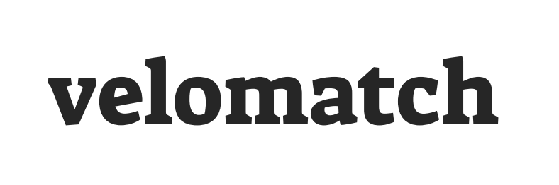

# Stock Broker

The Velomatch stock broker enables retailers to provide semi-real time updates for stock levels within their distribution warehouses or dealer shops. This readme details the technical details and requirements of developing and integrating with our stock broker service. By integrating stock within the solution, Velomatch is able to: 

- Indicate stock availability to all prospective clients
- Drive high quality enquires for bikes in stock

## Data Required

**Top Level** - These properties are used to identify and authenticate the information being sent. Note, the password should never be sent over as plain text and all of the information sent should always be encrypted. See the security section of this document for more information. 

| Property   | Type   | Description                                                                                        |
|------------|--------|----------------------------------------------------------------------------------------------------|
| username   | string | The user name assigned to the end point being used for integration.                                |
| password   | string | The password assigned to the end point being used for integration.                                 |  
| datetime   | string | The date and time in ISO 8601 format representing when the data was accurate.                      |
| facilities | object | An object object representing a group of storage facilities in which data is going to be sent for. |

**Facilities** - A facility represents a shop floor, store, warehouse or distribution centre where stock is held ready for purchase. 

| Property     | Type    | Description                                                                                        |
|--------------|---------|----------------------------------------------------------------------------------------------------|
| facility     | object  | An object representing a facility where stock is stored and available for purchase.                |
| facilitycode | string  | The code given to identify the facility in which stock shall be provided.                          |
| partial      | boolean | Indicate if the update given for the facility is a complete inventory of stock (```false```), or a partial update (```true```). If a complete inventory is provided, any products not specified shall have an assumed a stock value of zero. |
| stock        | object  | An object representing a list of items which are in stock.                                         |
| forecast     | object  | An object representing a list of items for which a delivery is forecasted.                         |

**Forecast** - A forecast object represents a forecasted delivery of new stock which shall be available for purchase. All forecasts should be sent for a facility with each update and any previously sent forecasts which are not sent again shall be assumed cancelled. 

| Property     | Type    | Description                                                                                                  |
|--------------|---------|--------------------------------------------------------------------------------------------------------------|
| forecast     | object  | An object representing a forecasted delivery of stock to the facility.                                       |
| forecastid   | string  | A unique identifier for the forecast delivery within in the scope of the facility.                            |
| datetime     | string  | The date and time in ISO 8601 format representing when new stock is forecasted to be available for purchase. |
| stock        | Number  | An object representing a list of items which will be delivered.                                              |


**Stock** - A generic object representing stock and the quality available. Note, this object is used in both the facility and forecast objects, and as such either represents the live stock position, or the products which are forecasted to be delivered. 

| Property     | Type    | Description                                                                                                 |
|--------------|---------|-------------------------------------------------------------------------------------------------------------|
| unit         | object  | An object representing a unit of stock                                                                      |
| sku          | string  | The stock keeping unit code given to identify the stock item.                                               |
| quantity     | Number  | The quantity of units available for sale, or to be delivered to this facility (depending on parent object). |


## Data Format

The business supports representing the data specified in one of three formats. JSON, XML and CSV. 

### JSON

JSON (JavaScript Object Notation) is an open standard file format and data interchange format that uses human-readable text to store and transmit data objects consisting of attribute–value pairs and arrays (or other serializable values).  It is a common data format with diverse uses in electronic data interchange, including that of web applications with servers. JSON is a language-independent data format. It was derived from JavaScript, but many modern programming languages include code to generate and parse JSON-format data. JSON filenames use the extension .json. All properties are required unless specified. 

**Top Level** - An example of the json for this is shown below. 

```json
{
  "username": "DistributerFoo",  
  "password": "PasswordBar",
  "datetime": "2021-11-24T14:40:40+0000", // ISO 8601
  "facilities": { ... }, // See Facilities below
}
```

**Facilities** - An example of the json for this is shown below. 

```json
"facility": [
    {
        "facilitycode": "f001",  
        "partial": False,
        "stock": { ... }, // See stock below
        "forecast": { ... }, // See forecast below
    },
    {
        "facilitycode": "f002",  
        "partial": True,
        "stock": { ... }, // See stock below
        "forecast": { ... }, // See forecast below
    },
]
```

**Forecast** - An example of the json for this is shown below. 

```json
"forecast": [
    {
        "forecastid": "f1001",
        "datetime": "2021-11-25T14:40:40+0000", // ISO 8601
        "stock": { ... }, // See stock below
    }
    {
        "forecastid": "f1002",
        "datetime": "2021-11-26T14:40:40+0000", // ISO 8601
        "stock": { ... }, // See stock below
    }
]
```

**Stock** - An example of the json for this is shown below. 

```json
"unit": [
    {
        "sku": "123-456-789",
        "quantity": 4,
    },
    {
        "sku": "223-456-789",
        "quantity": 7,
    },
    {
        "sku": "324-456-789",
        "quantity": 0,
    },
]
```

**Complete Example** - Below is a fictional representation of a single JSON file updating the stock of two facilities with deliveries forecasted. 

```json
{
    "username": "DistributerFoo",
    "password": "PasswordBar",
    "datetime": "2021-11-24T14:40:40+0000",
    "facility": [
        {
            "facilitycode": "f001",
            "partial": False,
            "stock": { 
                "unit": [
                    {
                        "sku": "123-456-789",
                        "quantity": 4,
                    },
                    {
                        "sku": "223-456-789",
                        "quantity": 7,
                    },
                    {
                        "sku": "324-456-789",
                        "quantity": 0,
                    },
                ]
             },
            "forecast": { 
                "forecastid": "f1001",
                "datetime": "2021-11-26T14:40:40+0000",
                "stock": { 
                    "unit": [
                        {
                            "sku": "324-456-789",
                            "quantity": 3,
                        },
                    ]
                },
            }, 
        },
        {
            "facilitycode": "f002", 
            "partial": True,
            "stock": { 
                "unit": [
                    {
                        "sku": "423-456-789",
                        "quantity": 3,
                    },
                    {
                        "sku": "523-456-789",
                        "quantity": 6,
                    },
                    {
                        "sku": "624-456-789",
                        "quantity": 2,
                    },
                ]
             },
            "forecast": [ 
                { 
                    "forecastid": "f1002",
                    "datetime": "2021-11-28T14:40:40+0000",
                    "stock": { 
                        "unit": [
                            {
                                "sku": "624-456-789",
                                "quantity": 2,
                            },
                        ]
                    },
                }, 
                { 
                    "forecastid": "f1003",
                    "datetime": "2021-12-01T14:40:40+0000",
                    "stock": { 
                        "unit": [
                            {
                                "sku": "423-456-789",
                                "quantity": 1,
                            },
                            {
                                "sku": "524-456-789",
                                "quantity": 3,
                            },
                        ]
                    },
                }, 
            ]
        }
    ]
}
```

### XML

eXtensible Markup Language (XML) is a markup language that defines a set of rules for encoding documents in a format that is both human-readable and machine-readable. The World Wide Web Consortium's XML 1.0 Specification of 1998 and several other related specifications all of them free open standards—define XML. The design goals of XML emphasize simplicity, generality, and usability across the Internet. It is a textual data format with strong support via Unicode for different human languages. Although the design of XML focuses on documents, the language is widely used for the representation of arbitrary data structures such as those used in web services. Several schema systems exist to aid in the definition of XML-based languages, while programmers have developed many application programming interfaces (APIs) to aid the processing of XML data. 


**Top Level** - An example of the XML for this is shown below.

```xml
<Velomatch>
    <StockBroker username="DistributerFoo" password="PasswordBar" DateTime="2021-11-24T14:40:40+0000">
    </StockBroker>
</Velomatch>
```

**Facilities** - An example of the XML for this is shown below.

```xml
<Facilities>
    <Facility facilityCode="f001" partial="false">
    </Facility>
</Facilities>
```

**Forecast** - An example of the xml for this is shown below. 

```xml
<Forecasts>
    <Forecast forecastid="f1001" datetime="2021-11-25T14:40:40+0000">
    </Forecast>
    <Forecast forecastid="f1002" datetime="2021-11-26T14:40:40+0000">
    </Forecast>
</Forecasts>
```

**Stock** - An example of the xml for this is shown below. 

```xml
<Stock>
    <Unit sku="123-456-789" quantity="4" />
    <Unit sku="223-456-789" quantity="7" />
    <Unit sku="323-456-789" quantity="6" />
</Stock>
```

**Complete Example** - Below is a fictional representation of a single xml file updating the stock of two facilities with deliveries forecasted. 

```xml
<?xml version="1.0" encoding="ISO-8859-1" ?>
<Velomatch>
    <StockBroker username="DistributerFoo" password="PasswordBar" DateTime="2021-11-24T14:40:40+0000">
        <Facilities>
            <Facility facilityCode="f001" partial="false">
                <Stock>
                    <Unit sku="123-456-789" quantity="4" />
                    <Unit sku="223-456-789" quantity="7" />
                    <Unit sku="323-456-789" quantity="6" />
                </Stock>
                <Forecasts>
                    <Forecast forecastid="f1001" datetime="2021-11-25T14:40:40+0000">
                        <Stock>
                            <Unit sku="324-456-789" quantity="4" />
                        </Stock>
                    </Forecast>
                    <Forecast id="f1002" datetime="2021-11-26T14:40:40+0000">
                        <Stock>
                            <Unit sku="423-456-789" quantity="4" />
                            <Unit sku="523-456-789" quantity="7" />
                            <Unit sku="623-456-789" quantity="6" />
                        </Stock>
                    </Forecast>
                </Forecasts>
            </Facility>
        </Facilities>
    </StockBroker>
</Velomatch>
```

### CSV

A comma-separated values (CSV) file is a delimited text file that uses a comma to separate values. Each line of the file is a data record. Each record consists of one or more fields, separated by commas. The use of the comma as a field separator is the source of the name for this file format. 

As CSV is a flat file format it is not possible to nest objects within one another as per the JSON and XML formats. This in turn means there is a significant amount of redundant data sent through this protocol. Velomatch therefore recommends using one of the more object orientated formats. 

Text qualifiers within the CSV file should use the double or single quotes format. Date and time formats should use universal time format (UTC), or shall be assumed to be within the United Kingdom (London) timezone following the United Kingdom day-month-year hour-minute-second format. The use of a header is optional and is detected when the data is processed. 

Line 1 (and 2 if a header is used) shall include end point authentication information to identify the data source. 

```csv
username,password,DateTime
"DistributerFoo","PasswordBar",2021-11-24T14:40:40+0000
```
Line 2 (or three) shall represent the stock information. The first set of attributes determine the facility, sku and current stock quantity which is available for sale. 

Should any deliveries be forecasted, one or more key value pairs of ```datetime``` and ```quantity``` shall be given representing a unique delivery. There is no limit to the number of date time and quantity key value pairs which can be sent and the order is not important. There is no requirement to have the key value pair headers for the total amount of forecasted deliveries. 

```csv
facilitycode,sku,quantity,datetime,quantity,datetime,quantity
"f001","123-456-789",4
"f001","223-456-789",7
"f001","323-456-789",6
"f001","324-456-789",0,2021-11-25T14:40:40+0000,4,2021-11-29T10:00:40+0000,2
"f001","423-456-789",0,2021-11-25T14:40:40+0000,4
"f001","523-456-789",0,2021-11-25T14:40:40+0000,7
"f001","623-456-789",0,2021-11-25T14:40:40+0000,6
```

Example without headers: 

```csv
"DistributerFoo","PasswordBar",2021-11-24T14:40:40+0000
"f001","123-456-789",4
"f001","223-456-789",7
"f001","323-456-789",6
"f001","324-456-789",0,2021-11-25T14:40:40+0000,4,2021-11-29T10:00:40+0000,2
"f001","423-456-789",0,2021-11-25T14:40:40+0000,4
"f001","523-456-789",0,2021-11-25T14:40:40+0000,7
"f001","623-456-789",0,2021-11-25T14:40:40+0000,6
```

File example with headers: 

```csv
username,password,DateTime
"DistributerFoo","PasswordBar",2021-11-24T14:40:40+0000
facilitycode,sku,quantity,datetime,quantity,datetime,quantity
"f001","123-456-789",4
"f001","223-456-789",7
"f001","323-456-789",6
"f001","324-456-789",0,2021-11-25T14:40:40+0000,4,2021-11-29T10:00:40+0000,2
"f001","423-456-789",0,2021-11-25T14:40:40+0000,4
"f001","523-456-789",0,2021-11-25T14:40:40+0000,7
"f001","623-456-789",0,2021-11-25T14:40:40+0000,6
```

## Protocol 

In the world of technology, there are vast numbers of users' communicating with different devices in different languages. That also includes many ways in which they transmit data along with the different software they implement. So, communicating worldwide will not be possible if there were no fixed 'standards' that will govern the way user communicates for data as well as the way our devices treat those data. Here we will be discussing these standard set of rules.

Protocols which are set of rules that help in governing the way a particular technology will function for communication. In other words, it can be said that the protocols are digital languages implemented in the form of networking algorithms. There are different networks and network protocols, user's use while surfing.

### SFTP

File Transfer Protocol (FTP) is a communications protocol used to send files from computer to computer, with one of them acting as the server, providing the two have an Internet connection. File Transfer Protocol (SFTP) transfers files security using SSH and encrypted FTP commands to avoid password sniffing and exposing sensitive information in plain text. Secure Shell (SSH) provides a secure channel over an unsecured network by using a client–server architecture, connecting an SSH client application with an SSH server. 

It is recommended that the following file name format is used: ```[year][month][day][hour][minute][second]-[username].[extension]```. An example csv file name would be: ```20211202-velomatch.csv```.

## Examples

Noun. 1. good example - something to be imitated; "an exemplar of success"; "a model of clarity"; "he is the very model of a modern major general" exemplar, example, model. ideal - the idea of something that is perfect; something that one hopes to attain.

### Jupyter Notebook

The [Jupyter](https://jupyter.org/) Notebook is a web application for creating and sharing documents that contain code, visualizations, and text. It can be used for data science, statistical modeling, machine learning, and much more.

Access the [Velomatch Stock Broker Jupyter Notebook](stockBroker.ipynb).

## Support

Velomatch is here to help and guide one through the process of achieving integration. Drop [Richard](mailto:richard@velomatch.com) a line with your problem and he will be happy to lend a hand. 

## About Velomatch

Cycling is glorious! The buying process often isn't... We're here to change that. Unbiased, expert advice without the hard sell. Make sure your next bike fits! Visit www.velomatch.com to try it out for yourself. 


